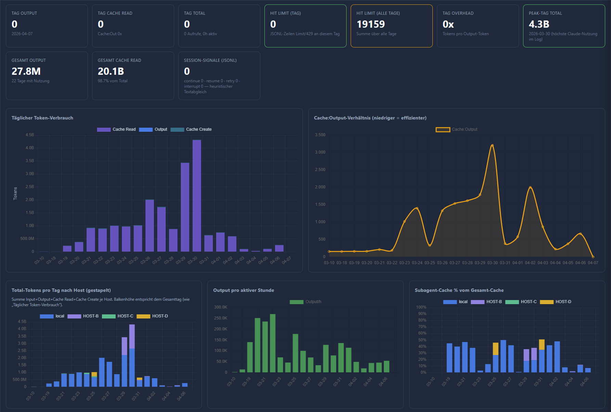
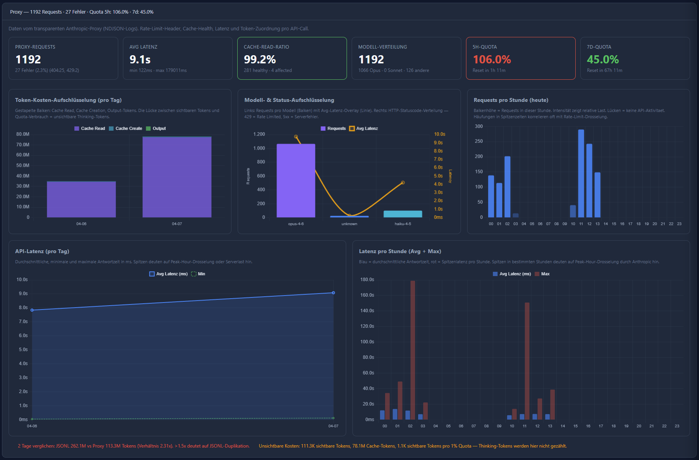

**[Deutsch](README.md)** · **[English](README.en.md)** · 한국어

## Claude Usage Dashboard

[](https://github.com/fgrosswig/claude-usage-dashboard/actions/workflows/docker.yml)

### 요약

**Anthropic / Claude Code 모니터링:** **셀프 호스팅 웹 대시보드** + 선택적 **Anthropic API 투명 HTTP Proxy** — **Token 흐름**, 휴리스틱 한도, **Forensic 분석**, Proxy 메트릭을 시각화합니다. **배경:** Anthropic 사용 시 (Claude Code, Max/세션 윈도우 등) 공식 카운터로는 설명되지 않는 **빠른 사용량 소진**이 자주 발생합니다. 데이터 소스: **`~/.claude/projects/**/*.jsonl`**, Proxy 활성화 시 **요청별 NDJSON** (지연 시간, 캐시, **Rate Limit 관련 헤더** 등). **`claude-*`** 모델만 집계 (`<synthetic>` 제외). **로컬** 또는 **Docker/Kubernetes**에서 실행 — 중앙 SaaS가 아닙니다.

### 참조 및 배경

- **측정 배경 (Proxy 아이디어):** **ArkNill**의 **[Claude Code Hidden Problem Analysis](https://github.com/ArkNill/claude-code-hidden-problem-analysis)** — Cache 버그, **5h/7d Quota**, Proxy 캡처 헤더에 대한 분석 문서. **이 프로젝트**는 Proxy/NDJSON 접근법을 대시보드에 구현하며, **심층 증거**는 **해당 레포**에 있습니다.
- **GitHub Issue 논의 (Claude Code):** **[anthropics/claude-code#38335](https://github.com/anthropics/claude-code/issues/38335)** — Max/세션 한도가 예상보다 훨씬 빠르게 소진되는 문제 (2026년 3월경 논의). **fgrosswig**이 **Forensic/측정 데이터**로 참여. 링크된 모든 코멘트와 이슈는 **동일한 주제** (사용량, 회귀, 커뮤니티 측정)에 속합니다.

**직접 URL:** [https://github.com/anthropics/claude-code/issues/38335](https://github.com/anthropics/claude-code/issues/38335) · [https://github.com/ArkNill/claude-code-hidden-problem-analysis](https://github.com/ArkNill/claude-code-hidden-problem-analysis)

아키텍처, 환경 변수, API는 **[문서](docs/README.md)** 참조.

### 문서

전체 가이드: **[docs/](docs/README.md)** (하위 페이지: 아키텍처, UI, Proxy, Forensic, 환경 변수, API).

- **English:** [docs/en/README.md](docs/en/README.md)  
- **Deutsch:** [docs/de/README.md](docs/de/README.md)

### 빠른 시작

```bash
node server.js              # 대시보드 :3333
node start.js both          # 대시보드 + Proxy :8080
node start.js forensics     # CLI 보고서
```

### Docker

두 이미지: **`Dockerfile.base`** (npm 의존성) → **`Dockerfile`** (앱). 로컬 빌드: `docker build -f Dockerfile.base -t claude-base:local .` 후 **`BASE_IMAGE=claude-base BASE_TAG=local docker compose build`**. **`docker compose up`** = **`node start.js both`**. 기타 모드: **`docker-compose.yml`** 헤더 참조. CI: **`docker-compose.ci.yml`**, **`.github/workflows/docker.yml`**.

### 스크린샷

**Token 개요** (대시보드) 및 **Proxy Analytics** — 추가 스크린샷: [docs/en/08-screenshots.md](docs/en/08-screenshots.md).




