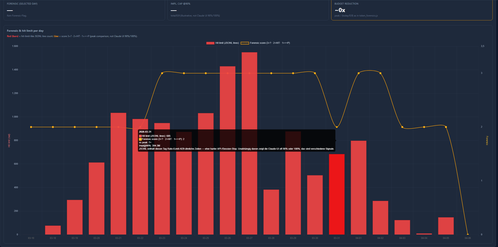
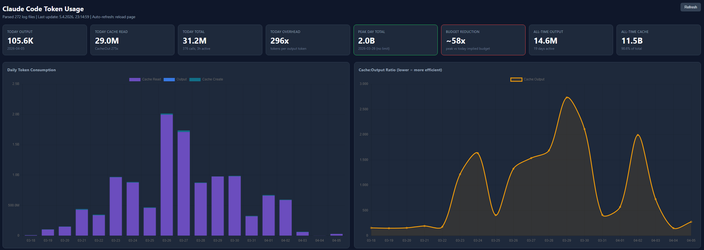
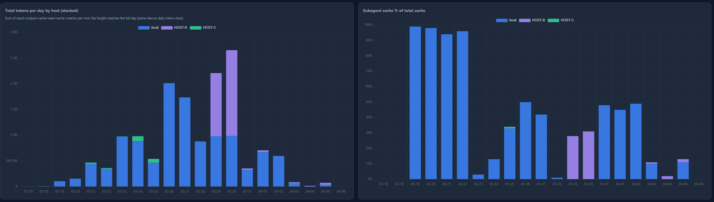
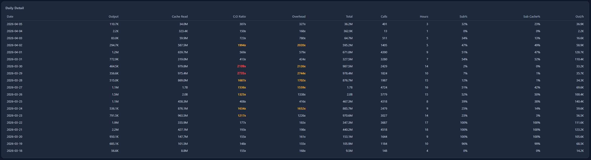

**[English](README.en.md)** · Deutsch

[](https://ci.grosswig-it.de/repos/3)

## Claude Usage Dashboard (`server.js` / `start.js`)

Standalone Node-Server (ohne npm-Abhängigkeiten im Skript), liest **Claude Code**-Logs unter **`~/.claude/projects/**/_.jsonl`** und zeigt Token-Nutzung, Limits (heuristisch) und Forensics in einer Web-UI. Es werden nur **`claude-_`**-Modelle gezählt (kein `<synthetic>`).

**Layout:** **`server.js`** bindet **`scripts/dashboard-server.js`**, **`scripts/dashboard-http.js`**, **`scripts/usage-scan-roots.js`** und **`scripts/service-logger.js`** (strukturierte Logs) ein. **Web-UI:** HTML **`tpl/dashboard.html`**, Styles **`public/css/dashboard.css`**, Browser-Logik **`public/js/dashboard.client.js`** (Chart.js per CDN im Template). Zum Einbetten/Extrahieren: **`scripts/extract-dashboard-assets.js`**. Starter **`start.js`** (`dashboard`, **`both`**, `proxy`, `forensics`). CLI-Forensik **`scripts/token-forensics.js`**. **`claude-usage-dashboard.js`** ist ein Alias für **`server.js`**.

**Server-Logging** (stderr, optional Datei): Umgebung **`CLAUDE_USAGE_LOG_LEVEL`** = `error` | `warn` | `info` (Standard) | `debug` | `none`. Datei-Append: **`CLAUDE_USAGE_LOG_FILE`** = Pfad (eine Zeile pro Eintrag, ISO-ähnlicher Zeitstempel). CLI: **`--log-level=…`**, **`--log-file=…`**. Themen u. a. **`scan`/`parse`** (JSONL), **`cache`** (Tages-Cache), **`outage`**, **`releases`**, **`marketplace`**, **`github`** (Release-Backfill), **`i18n`**, **`server`**.

**GitHub API (Releases):** Unauthentifiziert nur **~60 Requests/Stunde pro IP**; bei _rate limit exceeded_ **`GITHUB_TOKEN`** oder **`GH_TOKEN`** setzen (klassisches PAT genügt für öffentliche Releases, z. B. nur Leserechte). **Kein periodischer Fetch:** Es wird nur aus dem Netz geholt, wenn **`~/.claude/claude-code-releases.json`** fehlt oder leer ist — sonst nur Disk-Cache. Neu laden: **`POST /api/github-releases-refresh`** (lokal); optional **`CLAUDE_USAGE_ADMIN_TOKEN`** setzen, dann Request-Header **`Authorization: Bearer`** mit diesem Wert. Erzwungen beim Start: **`CLAUDE_USAGE_GITHUB_RELEASES_FETCH=1`**. **Optional im UI:** Im aufgeklappten Meta-Bereich PAT eintragen — nur **`sessionStorage`** dieser Registerkarte; der Browser sendet **`X-GitHub-Token`** an den Dashboard-Server (**Vorrang** vor `GITHUB_TOKEN`/`GH_TOKEN` für alle serverseitigen GitHub-Aufrufe nach dem Sync).

### UI-Texte (DE/EN, dynamisch)

- Alle Beschriftungen der Web-Oberfläche liegen als **JSON** unter **`tpl/de/ui.tpl`** und **`tpl/en/ui.tpl`** (Dateiendung `.tpl`, Inhalt gültiges JSON).
- **`/`** nutzt einen **In-Memory-Cache** (invalidiert sich, wenn sich die **mtime** von `tpl/de/ui.tpl` oder `tpl/en/ui.tpl` ändert): kein erneutes Einlesen/String-Replace pro Request. Texte ändern → Datei speichern → **Seite neu laden**.
- **`GET /api/i18n-bundles`** liefert dieselben Bundles (ebenfalls aus dem Cache, solange mtime gleich).
- **Erster Daten-Scan:** Der Server sendet **Zwischenstände per SSE** (`scan_progress`: gelesene Dateien / Gesamtzahl); Karten und Diagramme **füllen sich schrittweise** (Diagramm-Redraw ca. alle **420 ms** im Browser, damit es nicht ruckelt). Optional **`CLAUDE_USAGE_SCAN_FILES_PER_TICK`** — mehr JSONL pro Tick (Standard **20**, Bereich **1–80**; zu hoch = kurzes Stocken von HTTP/SSE während des Scans).
- Schlüssel sind flache String-IDs (z. B. `chartDailyToken`); Platzhalter wie `{n}` oder `{files}` werden im Client ersetzt.

### Start

```bash
node server.js
```

Oder generisch (Dashboard ist Standard):

```bash
node start.js
```

Dashboard und Anthropic-Proxy **in einem Terminal** (Dashboard-Port Standard **3333**, Proxy **8080** bzw. **`ANTHROPIC_PROXY_PORT`**):

```bash
node start.js both
```

### Optionen

```bash
node server.js --port=4444 --refresh=300
node server.js --log-level=debug --log-file=%USERPROFILE%\.claude\usage-dashboard-server.log
```

- **`--port`**: HTTP-Port (Standard `3333`).
- **`--log-level`**, **`--log-file`**: Server-Diagnose (siehe Abschnitt **Server-Logging** oben); entspricht den Umgebungsvariablen `CLAUDE_USAGE_LOG_*`.
- **`--refresh`**: Sekunden bis zum **nächsten vollen Daten-Scan** (alle JSONL) + SSE-Push — **Minimum `60`**, Standard **`180`**. Kürzere Werte verursachen ständiges Neu-Einlesen („tanzen“). Alternativ Umgebungsvariable **`CLAUDE_USAGE_SCAN_INTERVAL_SEC`** (≥ 60); `--refresh` setzt sie außer Kraft.

### Live-Updates

- Beim Öffnen der Seite: **`fetch('/api/usage')`** für den aktuellen Cache, parallel **SSE** (`/api/stream`).
- Grüner Punkt oben rechts = verbunden; Daten aktualisieren sich mit dem konfigurierten Intervall ohne manuellen Reload.
- Rot = Verbindungsabbruch, Browser versucht erneut zu verbinden.

### Schneller Start / Scan im Hintergrund

- Der Server **lauscht sofort**; der erste Parse läuft **nicht** blockierend vor `listen`.
- JSONL werden **in Batches** verarbeitet (`setImmediate` zwischen Dateigruppen), damit HTTP/SSE währenddessen bedienbar bleibt.
- Vor dem ersten fertigen Scan: Stub mit `scanning: true` und Hinweistext in der UI.

### Tages-Cache (Vortage in einer JSON)

- Datei: **`~/.claude/usage-dashboard-days.json`**
- Wenn **Cache-Version**, **Scan-Wurzeln** und **Anzahl** der `.jsonl`-Dateien passen, werden **Vortage** aus dieser Datei geladen und aus den Logs nur noch der **lokale Kalendertag „heute“** voll mitgezählt (schnellere Refreshes). **Kalenderlücken ohne Nutzung** in den Logs erzwingen **keinen** Vollscan — nur geänderte **`.jsonl`-Anzahl**, **Wurzeln**, **Cache-Version** oder **`CLAUDE_USAGE_NO_CACHE`**. Pro-Tag-**`hosts`** sind ab Cache-Version **3** enthalten; **Version 4** invalidiert alte Caches einmalig; **Version 5** ergänzt **`session_signals`** (JSONL-Heuristik: continue/resume/retry/interrupt) — einmaliger Neuaufbau des Tages-Caches.
- Optional **`CLAUDE_USAGE_SKIP_IDENTICAL_SCAN=1`**: Wenn sich an den relevanten **JSONL-mtimes** nichts geändert hat, kann ein erneuter **voller** Scan übersprungen werden (Fingerprint); nützlich bei häufigem Refresh ohne neue Logs.
- Im aufgeklappten **Meta-Block** werden die Pfade zu **Tages-Cache**, **Releases**, **Marketplace** und **Outage-JSON** angezeigt.
- **Vollscan** erzwingen: Umgebung **`CLAUDE_USAGE_NO_CACHE=1`** (oder `true`), **oder** Cache-Datei löschen, **oder** neue/entfernte `.jsonl` (andere Dateianzahl), **oder** andere **`CLAUDE_USAGE_EXTRA_BASES`** / andere Scan-Wurzeln (Cache enthält `scan_roots_key`).

### Weitere Rechner / importierte Logs (`CLAUDE_USAGE_EXTRA_BASES`)

Unter Linux und Windows unterschiedliche Pfade sind normal. Du kannst z. B. von einem anderen Host kopiertes **`projects`**-Baumwerk (oder nur relevante `.jsonl`-Ordner) irgendwo ablegen — sinnvoll z. B. als Ordner **`HOST-B`** — und zusätzlich einscannen:

- Umgebungsvariable **`CLAUDE_USAGE_EXTRA_BASES`**: ein oder mehrere Verzeichnisse, **mit `;` getrennt** (funktioniert auf Linux und Windows gleich).
- **Kurzform:** `true`, `1`, `yes`, `auto` oder `on` — dann werden unter **`CLAUDE_USAGE_EXTRA_BASES_ROOT`** (falls leer: **aktuelles Arbeitsverzeichnis** beim Start von Node) alle **Unterordner**, deren Name mit **`HOST-`** beginnt (z. B. `HOST-B`, `HOST-C`), als zusätzliche Wurzeln eingebunden (alphabetisch sortiert).
- Pfade dürfen **`~`** am Anfang nutzen oder absolut sein.
- **Label in der UI** = letzter Pfadbestandteil des jeweiligen Eintrags (z. B. `HOST-B` bei `.../imports/HOST-B`).
- Alle Quellen werden in **dieselben Tages-Aggregate** gemischt (eine gemeinsame Nutzungsansicht). **Doppelte** absolute Dateipfade werden nur **einmal** gezählt (z. B. identische Kopie unter zwei Wurzeln).
- **Pro Host:** In der API hat jeder Tag ein Objekt **`hosts`** (Schlüssel = Label, z. B. `local`, `HOST-B`) mit Total, Output, Calls, Hit-Limit, **`sub_cache`** / **`sub_cache_pct`** usw. In der UI erscheinen bei **mehreren Wurzeln** zusätzliche **Karten** und **Tabellenzeilen** pro Host (gewählter Tag) sowie ein **gestapeltes Balkendiagramm** „Total-Tokens pro Tag nach Host“ (Summe aller Hosts = Gesamttag wie das bestehende Token-Chart).
- **Subagent-Cache %:** Bei mehreren Wurzeln sind die Balken **gestapelt**: jedes Segment ist **Subagent-Cache dieses Hosts / Cache-Read des ganzen Tags** (in %); die **Stapelhöhe** entspricht dem Tageswert **Subagent-Cache % vom Gesamt-Cache** (Summe der Segmente; kleine Abweichungen nur durch Rundung).
- **Tagesdetail:** Klick auf eine **Host-Unterzeile** (`└ HOST-…`) zeigt nur noch diesen Host in der Tabelle (Überschrift enthält den Namen). Zurück: Button **„Alle Hosts“** oder Klick auf die **eine** gefilterte Zeile. **Anderer Tag** im Dropdown setzt den Host-Filter zurück.

Beispiel:

```bash
export CLAUDE_USAGE_EXTRA_BASES="$HOME/.claude/imports/HOST-B"
node server.js
```

Mehrere Ordner:

```bash
export CLAUDE_USAGE_EXTRA_BASES="$HOME/sync/win-projects;$HOME/.claude/imports/HOST-B"
```

Unterordner `HOST-*` automatisch (Root = aktuelles Verzeichnis):

```bash
export CLAUDE_USAGE_EXTRA_BASES=true
cd /pfad/zu/parent-mit-HOST-B-und-HOST-C
node /pfad/zu/server.js
```

Eigener Parent-Ordner (Windows PowerShell):

```powershell
$env:CLAUDE_USAGE_EXTRA_BASES = "true"
$env:CLAUDE_USAGE_EXTRA_BASES_ROOT = "C:\Temp"
node server.js
```

### Meta-Zeile & Legende (einklappbar)

- Unter der Hauptüberschrift: **aufklappbarer** Block (`<details>`) für Modell-Hinweis (**nur `claude-*`**, kein `<synthetic>`), die **volle Parse-/Statuszeile** (inkl. Cache-Modus und Hinweis zu Karten vs. Diagrammen), **Limit-/Datenquelle** und **Scan-Quellen** (mehrere Wurzeln).
- **Zugeklappt** siehst du nur eine **kurze Summary** (z. B. Anzahl Log-Dateien und Refresh-Intervall).
- **Aufgeklappt** ist der Text **kleiner** gesetzt, damit die Karten schneller ins Blickfeld rücken.
- Ob der Block offen ist, steuert **`sessionStorage`** unter **`usageMetaDetailsOpen`** (bleibt nach Reload erhalten).

### UI: Tag wählen (Karten & Tabelle)

- **Dropdown** „Karten & Tabelle (Tag wählen)“: alle Tage mit Daten (neueste oben).
- **Karten** und **Tagesdetail-Tabelle** beziehen sich auf den **gewählten** Tag; **Diagramme** und **Forensic-Chart** weiterhin über **alle** Tage.
- Auswahl wird in **`sessionStorage`** unter **`usageDashboardDay`** gespeichert.
- Wenn **Kalender-„heute“** in den Logs **0 Tokens** hat, erscheint ein kurzer Hinweis (älteren Tag wählen).

### Repository & `.gitignore`

- Im Repo u. a.: **`/HOST*/`** (lokale Import-Kopien), **`test_node*.js`**, **`node_modules/`**, **`.env` / `.env.*`** (mit Ausnahme optionaler **`.env.example`**). Je nach Stand können **`k8*`**, **`Dockerfile`** und **`docker-compose.yml`** zusätzlich ignoriert sein (lokale K8s-/Container-Artefakte erst nach Tests committen). Details in **`.gitignore`** — verhindert, dass Log-Importe oder Secrets versehentlich committed werden.

### Limits & Forensic (nur Heuristik)

- **Datenquelle** in der UI: generisch **`~/.claude/projects`** (keine absoluten Pfade mit Benutzernamen in der Anzeige/API).
- **Hit Limit (rot in Charts):** Zählt JSONL-Zeilen mit typischen Rate-/Limit-Mustern — **kein** direkter Anthropic-API-Nachweis.
- **Forensic** (einklappbar): Codes **`?`** (sehr hoher Cache-Read), **`HIT`** (Limit-Zeilen in Logs), **`<<P`** (strenger Peak-Vergleich mit Mindest-Output/Calls). **Nicht** gleichbedeutend mit der Claude-UI „90 % / 100 %“.
- **Forensic Session-Signale** (eigenes Diagramm): Pro Kalendertag **gestapelte Balken** — unten nach oben continue, resume, retry, interrupt, **oben** **Ausfallstunden** (skalierte Balkenhöhe, Tooltip mit echten Stunden; oben platziert, damit der Streifen nicht unter großen Interrupt-Anteilen liegt). **Lila Linie** = **Cache Read** (eigene rechte Skala) — Tages-Heuristik, kein Kausalbeweis.

### CLI-Forensik (`scripts/token-forensics.js`)

Separates Analyse-Tool mit **automatischer Peak- und Limit-Erkennung** (keine hardcodierten Daten). Nutzt **dieselben Scan-Wurzeln** wie das Dashboard (**`usage-scan-roots`**, inkl. **`CLAUDE_USAGE_EXTRA_BASES`**) und **Tages-Cache-Version 5**.

```bash
node start.js forensics
```

(Entspricht `node scripts/token-forensics.js` bzw. `node token_forensics.js` im Root.)

**Automatische Erkennung:**

- **Peak-Tag:** Tag mit dem höchsten Gesamtverbrauch (Input + Output + Cache Read + Cache Create).
- **Limit-Tage:** Tage mit ≥ 50 `rate_limit`/`429`/`session limit`-Zeilen in JSONL **oder** Cache-Read ≥ 500M.
- **Fazit-Vergleich:** Für den Budget-Vergleich wird der letzte Limit-Tag mit signifikanter Aktivität gewählt (≥ 50 Calls, ≥ 2 aktive Stunden), um aussagekräftige Ergebnisse zu liefern.

**7 Abschnitte:**

1. **Tagesübersicht** — Cache:Output-Ratio, aktive Stunden, automatisches Limit-Label pro Tag.
2. **Effizienz-Kollaps** — Overhead (Tokens pro Output-Token), Output/h, Subagent-Anteil.
3. **Subagent-Analyse** — Cache-Multiplikator: Subagent-Cache als Anteil am Gesamt-Cache.
4. **Budget-Schätzung** — Impliziertes Cap (`total/0.9`) pro Limit-Tag, Trend (↑↓→), Median-Bereich über alle aussagekräftigen Limit-Tage, Verhältnis zum Peak. Zeigt, wo das Token-Budget ungefähr liegt und ob es sich verändert hat.
5. **Stündliche Analyse** — Stundengenaue Aufschlüsselung des letzten aussagekräftigen Limit-Tags (oder heute).
6. **Fazit** — Vergleich Peak-Tag vs. Limit-Tag: impliziertes Budget, effektive Budget-Reduktion, geschätzte Minuten bis Limit.
7. **Visuell** — ASCII-Balkendiagramm mit Peak- und Limit-Markierungen.

**Rückschlüsse für MAX-Pläne:** Über den Peak/Limit-Vergleich lässt sich abschätzen, ob sich das Session-Budget verändert hat oder ob die Token-Gewichtung (Input/Output/Cache) angepasst wurde. Die `Cache:Output`-Ratio zeigt, wie effizient gearbeitet wird — weniger Subagents = weniger Cache-Overhead = längere Arbeit bis zum Limit.

### Anthropic-Monitor-Proxy (`start.js proxy` / `anthropic-proxy.js`)

Implementierung unter **`scripts/anthropic-proxy-core.js`** und **`scripts/anthropic-proxy-cli.js`**. Optionaler **HTTP-Forward-Proxy** (ohne Zusatz-Pakete): nimmt Anfragen wie die Anthropic-API entgegen und leitet sie an **`https://api.anthropic.com`** (oder `--upstream`) durch. Gedacht für **Monitor-Logs** und **Cache-Kennzahlen** direkt aus den API-Antworten, parallel zu den JSONL-Logs unter `~/.claude/projects`.

**Start:**

```bash
node start.js proxy --port=8080
```

(Entspricht `node anthropic-proxy.js --port=8080`.)

**Claude / kompatible Clients durch den Proxy schicken:**

```bash
ANTHROPIC_BASE_URL=http://127.0.0.1:8080 claude
```

Auf Windows (PowerShell) z. B.:

```powershell
$env:ANTHROPIC_BASE_URL = "http://127.0.0.1:8080"
claude
```

**Kontinuierliches Logging:** Jede abgeschlossene Upstream-Antwort erzeugt **eine NDJSON-Zeile** (Append), Standardpfad **`~/.claude/anthropic-proxy-logs/proxy-YYYY-MM-DD.ndjson`**. Felder u. a. **`ts_start` / `ts_end`**, **`duration_ms`**, **`path`**, **`upstream_status`**, aus Antworten extrahiertes **`usage`** (`input_tokens`, `output_tokens`, **`cache_read_input_tokens`**, **`cache_creation_input_tokens`**), **`cache_read_ratio`** (= `cache_read / (cache_read + cache_creation)` sofern der Nenner &gt; 0) und **`cache_health`**:

- **`healthy`:** Read-Anteil am Cache-Verkehr ≥ **80 %** (viel Wiederverwendung der Prompt-Cache-Slots).
- **`affected`:** Read-Anteil **&lt; 40 %** bei vorhandenem Cache-Schreib/Lese-Volumen (viel **Neuerstellung**, wenig **Lesen** — eher „Cache wird neu aufgebaut“).
- **`mixed`**, **`na`** (kein Cache-Token-Volumen), **`unknown`**.

**Rate-Limit & Metadaten:** Pro Zeile zusätzlich **`request_meta`** (u. a. `content_length`, `anthropic_version`, `anthropic_beta` aus eingehenden Request-Headern) und **`response_anthropic_headers`** (persistierte Upstream-Response-Header wie `anthropic-ratelimit-*`, `request-id` / `x-request-id`, `cf-ray`, weitere `anthropic-*`).

**Subagents & Tools:** Der Proxy sieht **HTTP** (`tools` im Request, `tool_use` / `tool_result` in JSON-Antworten) und schreibt Kurz-Hinweise in **`request_hints`** / **`response_hints`**. **Subagent-Sessions** stecken in der **Datei** der JSONL (Pfad enthält oft **`subagent`**); optional **`ANTHROPIC_PROXY_ALIGN_JSONL=1`**: heuristische Zuordnung der Proxy-Antwort zu einer **JSONL-Zeile** in `~/.claude/projects` (Zeitfenster + Token-Vergleich), Ergebnis in **`jsonl_alignment`** inkl. **`is_subagent_path`**.

Weitere Umgebung: **`ANTHROPIC_PROXY_LOG_DIR`**, **`ANTHROPIC_PROXY_LOG_STDOUT=1`** (eine Zeile pro Request), **`ANTHROPIC_PROXY_LOG_BODIES=1`** (Vorsicht: kann Inhalte/Secrets enthalten), **`ANTHROPIC_PROXY_JSONL_ROOTS`** (;-getrennt), **`ANTHROPIC_PROXY_BIND`** (Standard `127.0.0.1`). Details: **`node start.js proxy -- --help`** oder **`node anthropic-proxy.js --help`**.

### API (Kurz)

- **`GET /`**: HTML-Dashboard.
- **`GET /api/usage`**: JSON mit u. a. `days` (pro Tag `hosts`, `session_signals`, **`outage_hours`**, **`cache_read`**, …), `host_labels`, `calendar_today`, `day_cache_mode`, `scanning`, `parsed_files`, `scanned_files`, `scan_sources`, `forensic_*`.

### Daten ins Dashboard laden (Remote / Container)

Für eine Instanz, die **keinen** direkten Zugriff auf `~/.claude/projects` hat, können Logs per **HTTP** nachgeladen werden:

- **`POST /api/claude-data-sync`**: Request-Body = **gzip-komprimiertes Tar-Archiv**. Header **`Authorization: Bearer <CLAUDE_USAGE_SYNC_TOKEN>`** (Token muss serverseitig gesetzt sein).
- Beim Entpacken werden nur Pfade unter **`projects/**`** und **`anthropic-proxy-logs/**`** ins konfigurierte Datenverzeichnis übernommen (siehe **`scripts/claude-data-ingest.js`**).
- Maximale Upload-Größe: Umgebung **`CLAUDE_USAGE_SYNC_MAX_MB`** (Standard **512**).
- Hilfsskript zum Senden: **`scripts/claude-data-sync-client.js`** (Tar bauen, gzip, POST).

### Extension-Updates (Service-Impact-Chart & Report)

- **Kalenderdatum der Marker:** Primär **VS Code Marketplace** ([Version History](https://marketplace.visualstudio.com/items?itemName=anthropic.claude-code&ssr=false#version-history)): `lastUpdated`, je Semver das **späteste** Datum über alle Plattform-Vsix (entspricht eher der „Last Updated“-Anzeige in VS Code; früher war Minimum und konnte den Marker einen UTC-Tag zu früh setzen). Das Datum wird wie die JSONL-Tage als **UTC-Kalendertag** (`YYYY-MM-DD` aus dem ISO-Zeitstempel) behandelt — gleiche Logik wie `timestamp.slice(0,10)` bei `…Z`. Cache: **`%USERPROFILE%\.claude\claude-code-marketplace-versions.json`** (nicht der Projektordner).
- **Changelog-Zeilen:** **GitHub Releases** (bis zu 100 Einträge pro Fetch), gecacht unter **`%USERPROFILE%\.claude\claude-code-releases.json`**. **Datum** kommt aus dem Merge **Marketplace ∪ GitHub** (Marketplace setzt das Release-Datum, GitHub füllt fehlende Versionen auf, falls der Marketplace-Cache alt oder unvollständig war). Sonst JSONL-Fallback. (Cache-Dateien unter `.claude` im Profil ablegen.)
- **Version aus JSONL:** Für den Fallback und für Modell-/Host-Auswertung werden dieselben Felder wie oben auf **`Major.Minor.Patch`** normalisiert.
- Wenn ältere Tages-Caches noch **nicht normalisierte** Versions-Strings enthalten, einmal **Vollscan** auslösen (`CLAUDE_USAGE_NO_CACHE=1` oder Tages-Cache löschen).

### Screenshots





