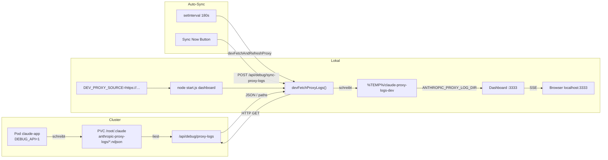

# Umgebungsvariablen, API, Deployment, Dev-Testing

[← Inhaltsverzeichnis](README.md)

## Umgebungsvariablen (Auszug)

| Variable | Default | Beschreibung |
| -------- | ------- | ------------ |
| `ANTHROPIC_PROXY_BIND` | `127.0.0.1` | Proxy-Bind-Adresse |
| `ANTHROPIC_PROXY_PORT` | `8080` | Proxy-Port |
| `ANTHROPIC_PROXY_LOG_DIR` | `~/.claude/anthropic-proxy-logs` | NDJSON-Verzeichnis |
| `CLAUDE_USAGE_EXTRA_BASES` | — | `auto` oder `;`-getrennte Pfade |
| `CLAUDE_USAGE_EXTRA_BASES_ROOT` | `cwd` | Root für `HOST-*` Auto-Discovery |
| `CLAUDE_USAGE_SYNC_TOKEN` | — | Token für `POST /api/claude-data-sync` |
| `CLAUDE_USAGE_SYNC_MAX_MB` | `512` | Max. Upload-Größe |
| `CLAUDE_USAGE_SCAN_INTERVAL_SEC` | `180` | Scan-Intervall (Min. 60) |
| `CLAUDE_USAGE_SCAN_FILES_PER_TICK` | `20` | JSONL pro SSE-Tick beim ersten Scan (1–80) |
| `CLAUDE_USAGE_NO_CACHE` | — | `1`/`true` erzwingt Vollscan |
| `CLAUDE_USAGE_SKIP_IDENTICAL_SCAN` | — | `1`: Scan bei gleichem Fingerprint überspringen |
| `CLAUDE_USAGE_LOG_LEVEL` | `info` | `error` / `warn` / `info` / `debug` / `none` |
| `CLAUDE_USAGE_LOG_FILE` | — | Zusätzliche Log-Datei |
| `GITHUB_TOKEN` / `GH_TOKEN` | — | PAT für Releases |
| `CLAUDE_USAGE_ADMIN_TOKEN` | — | Bearer für Admin-Endpunkte |
| `DEBUG_API` | — | `1`: u. a. `/api/debug/proxy-logs` |
| `DEV_PROXY_SOURCE` | — | Remote-Dashboard-URL für Dev |
| `DEV_MODE` | — | `proxy` oder `full` (Remote-Daten) |

Proxy-spezifisch siehe [Anthropic Proxy](05-anthropic-proxy.md) und `node … proxy --help`.

## API (kurz)

- **`GET /`**: HTML-Dashboard.
- **`GET /api/usage`**: JSON mit `days` (`hosts`, `session_signals`, `outage_hours`, `cache_read`, …), `host_labels`, `day_cache_mode`, `scanning`, `parsed_files`, `scan_sources`, `forensic_*`, …
- **`GET /api/i18n-bundles`**: DE/EN-Bundles.
- **`POST /api/claude-data-sync`**: gzip-tar Upload.
- **`POST /api/github-releases-refresh`**: Releases neu laden.

## Deployment (Kurz)

```bash
node start.js both          # Dashboard + Proxy
node start.js dashboard
node start.js proxy
```

## Docker

Zwei-Stufen-Image wie in **`docker-compose.yml`** skizziert:

1. **Base:** `docker build -f Dockerfile.base -t claude-base:local .` (npm-Dependencies).
2. **App:** Compose baut mit **`BASE_IMAGE`** / **`BASE_TAG`** (siehe `docker-compose.yml`; dort stehen Platzhalter nur als Beispiel).

**Standard:** `docker compose up` entspricht **`node start.js both`** (Dashboard **3333**, Proxy **8080**). Das Datenverzeichnis **`~/.claude`** kommt per Bind-Mount ins Image; Pfad auf dem Host über **`CLAUDE_CONFIG_DIR`** steuerbar (Standard: `${HOME}/.claude`).

**Weitere Modi** (ohne Compose-Standardbefehl zu ändern): einmalig `docker compose run --rm --service-ports claude-usage node start.js dashboard|proxy|forensics` — siehe Kommentarkopf in **`docker-compose.yml`**.

**Compose für CI/ohne Host-`~/.claude`:** **`docker-compose.ci.yml`** mergen (u. a. **tmpfs** unter `/root/.claude`, Image-Tag über **`CLAUDE_USAGE_IMAGE`**). Ablauf kurz in den Dateikommentaren und in **`.github/workflows/docker.yml`**.

## CI (GitHub Actions)

Workflow **`.github/workflows/docker.yml`** (bei Push/PR auf u. a. `main`): baut Base- und App-Image, **Smoke** mit **`curl`** auf **`/`** und **`/api/usage`** (Port **3333**, **tmpfs** statt Host-`~/.claude`), danach **Container-Logs**; anschließend zweiter Lauf mit **Compose** (**`docker-compose.yml`** + **`docker-compose.ci.yml`**, nur **3333** nach außen).

Kubernetes-Manifeste und Cluster-Betrieb: **[k8s/README.md](../../k8s/README.md)**.

## Öffentlicher GitHub-Spiegel (Maintainer)

Primär **Gitea**, öffentliches Repo **[claude-usage-dashboard](https://github.com/fgrosswig/claude-usage-dashboard)** auf GitHub — konkrete Git-Befehle (zweites Remote, Push von `main`, Branch-Mapping für Feature-PRs): **[README.md](../../README.md)** im Repo-Root, Abschnitt *Gitea und GitHub*.

## Lokales Dev-Testing (Remote-Daten)

Das Dashboard kann **Proxy-NDJSON** von einem **Remote-Server** holen und lokal unter **`http://localhost:3333`** nutzen (sinnvoll z. B. wenn eingesetzte Instanz im **Kubernetes**-Cluster läuft und dort **`DEBUG_API=1`** gesetzt ist — siehe **`k8s/base/deployment.yml`**). Dann liefert **`/api/debug/proxy-logs`** Metadaten zu den Log-Dateien.

**Platzhalter (nur Doku, durch eure echten Hosts ersetzen):**

| Platzhalter | Rolle |
|-------------|--------|
| **`https://dashboard.host.domain.tld`** | Web-UI des Dashboards (**HTTPS** wie im Browser). Basis-URL für **`DEV_PROXY_SOURCE`**. |
| **`http://proxy.host.domain.tld:8080`** | Typische **Anthropic-Monitor-Proxy**-Adresse für **`ANTHROPIC_BASE_URL`** (Port/Schema/TLS je nach Ingress — siehe [Proxy](05-anthropic-proxy.md), [k8s/README.md](../../k8s/README.md)). |

Die folgenden Kommandos nutzen **nur** den **Dashboard**-Platzhalter (Dev-Sync der Proxy-Logs über die HTTP-API des Dashboards).

**PowerShell:**

```powershell
$env:DEV_PROXY_SOURCE="https://dashboard.host.domain.tld"; node start.js dashboard
```

**CMD:**

```cmd
set DEV_PROXY_SOURCE=https://dashboard.host.domain.tld && node start.js dashboard
```

**bash / Linux / macOS:**

```bash
DEV_PROXY_SOURCE=https://dashboard.host.domain.tld node start.js dashboard
```

**Mit vollständigem Remote-Bezug** (`DEV_MODE=full`):

```powershell
$env:DEV_PROXY_SOURCE="https://dashboard.host.domain.tld"
$env:DEV_MODE="full"
node start.js dashboard
```

```bash
DEV_PROXY_SOURCE=https://dashboard.host.domain.tld DEV_MODE=full node start.js dashboard
```

- **`DEV_MODE=proxy`**: nur Proxy-Logs remote, JSONL lokal.
- Download-Ziel: **`%TEMP%\claude-proxy-logs-dev`** (Windows) bzw. **`/tmp/claude-proxy-logs-dev`** (Unix).
- Banner mit Sync; Auto-Sync ca. **180 s**; **`node start.js both`** ist mit `DEV_PROXY_SOURCE` **blockiert** (kein lokaler Proxy im Dev-Modus).

### Ablauf (Mermaid)



**English:** same flow in [07-config-api-deployment.md](../en/07-config-api-deployment.md#dev-testing-remote-data).
