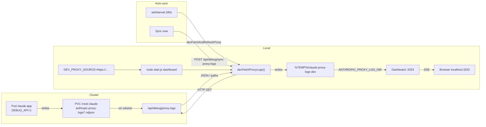

# Config, API, deployment, dev

[← Contents](README.md)

## Environment variables (selected)

| Variable | Default | Description |
| -------- | ------- | ----------- |
| `ANTHROPIC_PROXY_BIND` | `127.0.0.1` | Proxy bind address |
| `ANTHROPIC_PROXY_PORT` | `8080` | Proxy port |
| `ANTHROPIC_PROXY_LOG_DIR` | `~/.claude/anthropic-proxy-logs` | NDJSON directory |
| `CLAUDE_USAGE_EXTRA_BASES` | — | `auto` or `;`-separated paths |
| `CLAUDE_USAGE_EXTRA_BASES_ROOT` | `cwd` | Root for `HOST-*` auto-discovery |
| `CLAUDE_USAGE_SYNC_TOKEN` | — | Token for `POST /api/claude-data-sync` |
| `CLAUDE_USAGE_SYNC_MAX_MB` | `512` | Max upload size |
| `CLAUDE_USAGE_SCAN_INTERVAL_SEC` | `180` | Scan interval (min. 60) |
| `CLAUDE_USAGE_SCAN_FILES_PER_TICK` | `20` | JSONL files per SSE tick on first scan (1–80) |
| `CLAUDE_USAGE_NO_CACHE` | — | `1` / `true` forces full scan |
| `CLAUDE_USAGE_SKIP_IDENTICAL_SCAN` | — | `1`: skip scan if fingerprint unchanged |
| `CLAUDE_USAGE_LOG_LEVEL` | `info` | `error` / `warn` / `info` / `debug` / `none` |
| `CLAUDE_USAGE_LOG_FILE` | — | Extra log file |
| `GITHUB_TOKEN` / `GH_TOKEN` | — | PAT for GitHub API (releases) |
| `CLAUDE_USAGE_ADMIN_TOKEN` | — | Bearer for admin endpoints |
| `DEBUG_API` | — | `1`: e.g. `/api/debug/proxy-logs` |
| `DEV_PROXY_SOURCE` | — | Remote dashboard URL for dev |
| `DEV_MODE` | — | `proxy` or `full` (remote data) |

Proxy-specific flags: **`node … proxy --help`** and [Proxy](05-proxy.md).

## API (short)

- **`GET /`**: HTML dashboard.
- **`GET /api/usage`**: JSON with `days` (`hosts`, `session_signals`, `outage_hours`, `cache_read`, …), `host_labels`, `day_cache_mode`, `scanning`, `parsed_files`, `scan_sources`, `forensic_*`, …
- **`GET /api/i18n-bundles`**: DE/EN bundles.
- **`POST /api/claude-data-sync`**: gzip-tar upload.
- **`POST /api/github-releases-refresh`**: refresh releases cache.

## Deployment (short)

```bash
node start.js both          # dashboard + proxy
node start.js dashboard
node start.js proxy
```

## Docker

Two-stage image as in **`docker-compose.yml`**:

1. **Base:** `docker build -f Dockerfile.base -t claude-base:local .` (npm deps).
2. **App:** Compose build uses **`BASE_IMAGE`** / **`BASE_TAG`** (see `docker-compose.yml`; registry placeholders are examples only).

**Default:** `docker compose up` equals **`node start.js both`** (dashboard **3333**, proxy **8080**). Host **`~/.claude`** is bind-mounted; override with **`CLAUDE_CONFIG_DIR`** (default `${HOME}/.claude`).

**Other modes** without editing the default compose command:  
`docker compose run --rm --service-ports claude-usage node start.js dashboard|proxy|forensics` — see the comment header in **`docker-compose.yml`**.

**Compose for CI / no host `~/.claude`:** merge **`docker-compose.ci.yml`** (e.g. **tmpfs** at `/root/.claude`, image tag via **`CLAUDE_USAGE_IMAGE`**). Steps are summarized in the file comments and in **`.github/workflows/docker.yml`**.

## CI (GitHub Actions)

**`.github/workflows/docker.yml`** (on push/PR to e.g. `main`): builds base + app images, **smoke** with **`curl`** on **`/`** and **`/api/usage`** (port **3333**, **tmpfs** instead of host `~/.claude`), then **container logs**; then a second run with **compose** (**`docker-compose.yml`** + **`docker-compose.ci.yml`**, only **3333** published).

Kubernetes manifests and deployment: **[k8s/README.md](../../k8s/README.md)**.

## Public GitHub mirror (maintainers)

Work primarily on **Gitea**; public repo **[claude-usage-dashboard](https://github.com/fgrosswig/claude-usage-dashboard)** on GitHub. Git commands (second remote, pushing `main`, feature branch mapping): root **[README.en.md](../../README.en.md)**, section *Gitea and GitHub*.

## Dev testing (remote data)

The app can pull **proxy NDJSON** from a **remote** dashboard and run locally at **`http://localhost:3333`**. Typical case: the remote instance runs in **Kubernetes** with **`DEBUG_API=1`** (see **`k8s/base/deployment.yml`**), exposing **`/api/debug/proxy-logs`**.

**Placeholders (docs only — use your real hostnames):**

| Placeholder | Role |
|-------------|------|
| **`https://dashboard.host.domain.tld`** | Dashboard web UI (**HTTPS** as in the browser). Base URL for **`DEV_PROXY_SOURCE`**. |
| **`http://proxy.host.domain.tld:8080`** | Typical **Anthropic monitor proxy** URL for **`ANTHROPIC_BASE_URL`** (port/scheme/TLS depend on your ingress — see [Proxy](05-proxy.md), [k8s/README.md](../../k8s/README.md)). |

The commands below use **only** the **dashboard** placeholder (dev sync via the dashboard HTTP API).

**PowerShell:**

```powershell
$env:DEV_PROXY_SOURCE="https://dashboard.host.domain.tld"; node start.js dashboard
```

**CMD:**

```cmd
set DEV_PROXY_SOURCE=https://dashboard.host.domain.tld && node start.js dashboard
```

**bash / Linux / macOS:**

```bash
DEV_PROXY_SOURCE=https://dashboard.host.domain.tld node start.js dashboard
```

**Full remote mode** (`DEV_MODE=full`):

```powershell
$env:DEV_PROXY_SOURCE="https://dashboard.host.domain.tld"
$env:DEV_MODE="full"
node start.js dashboard
```

```bash
DEV_PROXY_SOURCE=https://dashboard.host.domain.tld DEV_MODE=full node start.js dashboard
```

- **`DEV_MODE=proxy`**: proxy logs remote, JSONL local.
- Download target: **`%TEMP%/claude-proxy-logs-dev`** (Windows) or **`/tmp/claude-proxy-logs-dev`** (Unix).
- **`node start.js both`** is **blocked** when **`DEV_PROXY_SOURCE`** is set (no local proxy in dev mode).
- Banner + sync; auto-sync about **180 s**.

### Flow (Mermaid)



*(German version of this chapter: [07-umgebung-api-deployment-dev.md](../de/07-umgebung-api-deployment-dev.md#lokales-dev-testing-remote-daten).)*
