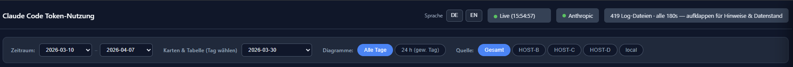
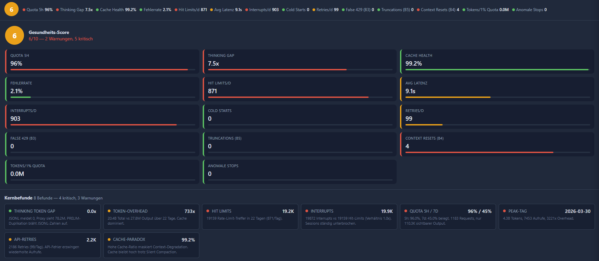
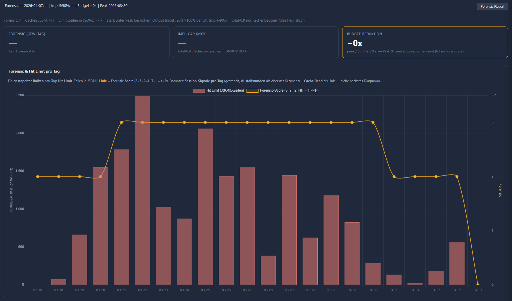
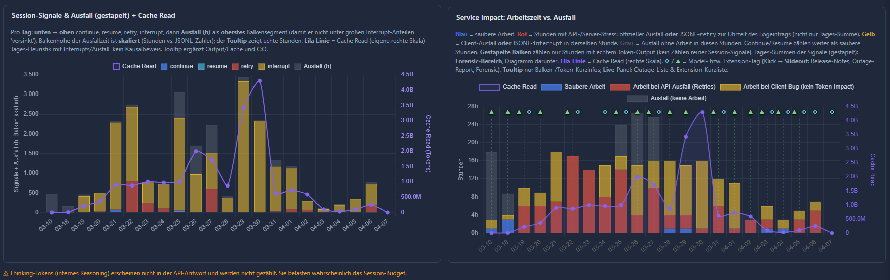
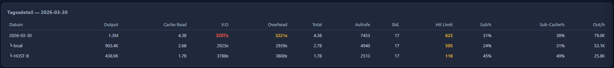
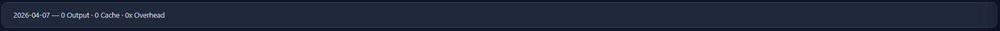
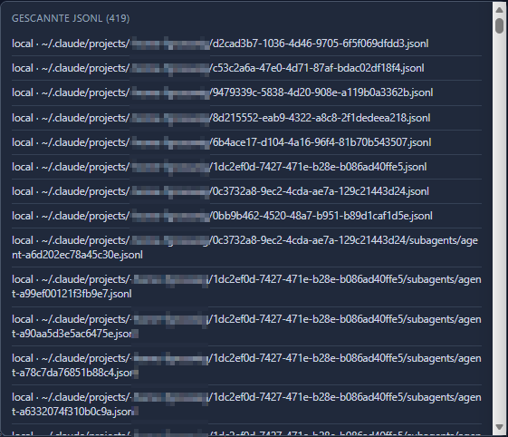
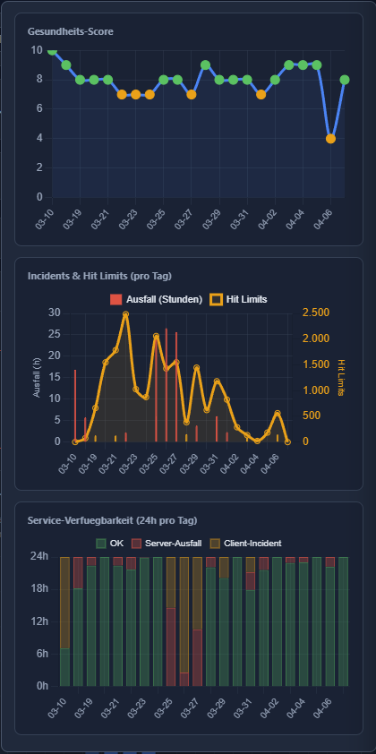
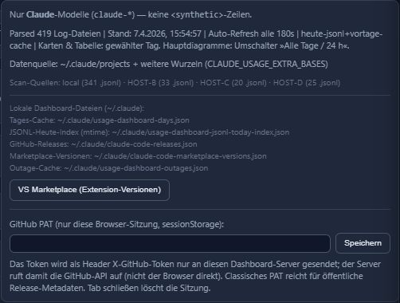

# Screenshots

[← Contents](README.md)

Paths from repo root: **`images/`** — **all** screenshots live there; there is no separate image directory.

Tables are the **index**; below that, each **preview** has a **heading** and a short **description** of what you see.

## Two screenshots in the root README

These **two** files are embedded in **[README.md](../../README.md)** and **[README.en.md](../../README.en.md)** on the repo landing page: **token overview** and **proxy analytics**.

| File | Topic |
| ---- | ----- |
| `main_overview_statistics.png` | Token cards & main charts |
| `proxy_statistics.png` | Proxy dashboard |

### Preview (same as README)

#### Token cards & main charts

**Stat cards** (output, cache, calls, …) for the selected day plus **main charts** (token usage over time, cache vs output, load).

#### Proxy dashboard

Anthropic **monitor proxy** view: **request** counts, **latency**, **cache** ratio, **models**, optional **quota** cards and **time-series** charts.

## More UI captures (documentation only)

The **root README** stays minimal; these **five** PNGs from **`images/`** are documented here but **not** on the landing page.

| File | Topic |
| ---- | ----- |
| `top_nav_prod.png` | Nav, filters, live/meta |
| `healthstatus.png` | Health score, key findings |
| `forensic_hitlimitdaily.png` | Daily forensic & hit limits |
| `forensic_session_service_interrupts.png` | Session signals & service impact |
| `table_details.png` | Daily detail table (multi-host) |

### Preview

#### Nav, filters, live & meta

**Top bar:** **language** switch, **date range** (start/end), **host** filter, **scope** (all days vs 24 h), **live** SSE indicator, **Anthropic** / **meta** badges; navigation across views.

#### Health score & key findings

**Health “traffic light”** with overall score and **key findings**; per-**indicator** traffic lights (**green / amber / red**) (quota, latency, limits, …); often trend context and a compact finding list.

#### Daily forensic & hit limits

Forensic section with **hit-limit** style highlights and **day-level** metrics; combines heuristic limit signals from JSONL with chart context.

#### Session signals & service impact

**Session signals** (e.g. continue / resume / retry / interrupt) as a summary; alongside or below, **service impact** / availability for the selected range.

#### Daily detail table (multi-host)

**Tabular day details** (hosts, tokens, calls, …); with several sources, **per-host rows** or an aggregated view with host context.

## Additional screenshots from **`images/**`

**More** PNGs (meta, scan list, compact strips …) are **not** in the README gallery; short captions here.

| File | Short description |
| ---- | ----------------- |
| `healthstatus_overview.png` | Compact health strip |
| `forensic_overview.png` | Forensic header + report |
| `main_overview.png` | One-line day summary |
| `github_integration.png` | Meta: paths, PAT, sources |
| `scores_service_charts.png` | Health trend, incidents, 24 h availability |
| `dataparse_logfiles_details.png` | Scanned JSONL list |

### Preview (these screenshots)

#### Compact health strip

**Collapsed** or **compact** health block: a single **strip** of the key status badges without the full key-findings layout.

#### Forensic header & report

**Forensic** title row with controls/status; **report** button or export entry for the forensic summary.

#### One-line day summary

**One line** (or a very tight block) with **core numbers** for the selected calendar day — quick context above the large cards.

#### Logfiles, health trend & meta (side by side)

<table>
  <tbody>
    <tr valign="top">
      <td align="left"><strong>JSONL / scan</strong> Discovered <code>.jsonl</code> files and path snippets — what is included in the current scan.</td>
      <td align="left"><strong>Health &amp; availability</strong> Health-score series, Anthropic incident markers, 24 h usage / availability.</td>
      <td align="left"><strong>Meta panel</strong> Paths to day cache, releases, marketplace; optional PAT for releases; scan roots.</td>
    </tr>
    <tr valign="top">
      <td align="left"></td>
      <td align="left"></td>
      <td align="left"></td>
    </tr>
  </tbody>
</table>
