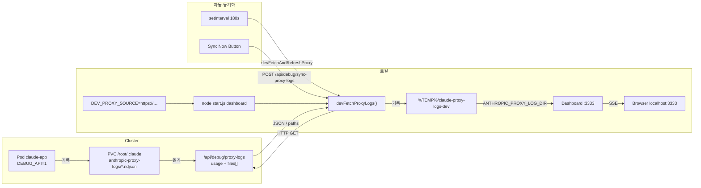

# 설정, API, 배포, 개발 테스트

[← 목차](README.md)

## 환경 변수(발췌)

| 변수 | 기본값 | 설명 |
| ---- | ------ | ---- |
| `ANTHROPIC_PROXY_BIND` | `127.0.0.1` | 프록시 바인드 주소 |
| `ANTHROPIC_PROXY_PORT` | `8080` | 프록시 포트 |
| `ANTHROPIC_PROXY_LOG_DIR` | `~/.claude/anthropic-proxy-logs` | NDJSON 디렉터리 |
| `CLAUDE_USAGE_EXTRA_BASES` | — | `auto` 또는 `;`로 구분된 경로 |
| `CLAUDE_USAGE_EXTRA_BASES_ROOT` | `cwd` | `HOST-*` 자동 탐색 루트 |
| `CLAUDE_USAGE_SYNC_TOKEN` | — | `POST /api/claude-data-sync`용 토큰(Kubernetes에서는 Secret **`sync-token`** — **`k8s/base/deployment.yml`** / **`k8s/README.md`**) |
| `CLAUDE_USAGE_SYNC_MAX_MB` | `512` | 업로드 최대 크기 |
| `CLAUDE_USAGE_SCAN_INTERVAL_SEC` | `180` | 스캔 간격(최소 60) |
| `CLAUDE_USAGE_SCAN_FILES_PER_TICK` | `20` | 첫 스캔 시 SSE 틱당 JSONL 수(1–80) |
| `CLAUDE_USAGE_NO_CACHE` | — | `1`/`true`이면 전체 스캔 강제 |
| `CLAUDE_USAGE_SKIP_IDENTICAL_SCAN` | — | `1`: 동일 핑거프린트일 때 스캔 건너뜀 |
| `CLAUDE_USAGE_LOG_LEVEL` | `info` | `error` / `warn` / `info` / `debug` / `none` |
| `CLAUDE_USAGE_LOG_FILE` | — | 추가 로그 파일 |
| `GITHUB_TOKEN` / `GH_TOKEN` | — | 릴리스용 PAT |
| `CLAUDE_USAGE_ADMIN_TOKEN` | — | 관리 엔드포인트용 Bearer 토큰 |
| `DEBUG_API` | — | `1`: 보호된 디버그 HTTP 경로 활성화 — 아래 **DEBUG-API** 참조 |
| `DEV_PROXY_SOURCE` | — | 개발용 원격 대시보드 URL |
| `DEV_MODE` | — | `proxy` 또는 `full`(원격 데이터) |

프록시 전용 옵션은 [Anthropic Proxy](05-anthropic-proxy.md) 및 `node … proxy --help`를 참고하세요.

## API(요약)

- **`GET /`**: HTML 대시보드.
- **`GET /api/usage`**: `days`(`hosts`, `session_signals`, `outage_hours`, `cache_read`, …), `host_labels`, `day_cache_mode`, `scanning`, `parsed_files`, `scan_sources`, `forensic_*`, … 등이 포함된 JSON.
- **`GET /api/i18n-bundles`**: DE/EN 번들.
- **`POST /api/claude-data-sync`**: gzip-tar 업로드.
- **`POST /api/github-releases-refresh`**: 릴리스 새로고침.

## DEBUG-API

**`DEBUG_API=1`**은 민감하거나 부하가 큰 경로를 활성화합니다 — 프로덕션에서는 네트워크가 신뢰할 수 있는 환경(예: 클러스터 내부/VPN)에서만 설정하세요. **`k8s/base/deployment.yml`**은 배포된 Pod에 이 값을 설정합니다.

| 메서드 | 경로 | `DEBUG_API` | 설명 |
|--------|------|-------------|------|
| **GET** | **`/api/debug/proxy-logs`** | **필수** | JSON **`{ usage, files }`**: **`usage`** = 전체 **`cachedData`** 스냅샷(**`GET /api/usage`**와 동일한 구조). **`files`** = 프록시 로그 디렉터리의 모든 **`proxy-*.ndjson`**에 대한 **`{ name, content }`** 배열 — **`DEV_MODE=proxy`**가 실제 NDJSON 파일을 로컬 임시 디렉터리에 기록하는 데 필요합니다. |
| **POST** | **`/api/debug/cache-reset`** | **필수** | 일별 캐시와 JSONL "오늘" 인덱스를 삭제하고 **전체** 리스캔을 시작합니다. 일부 원격 개발 워크플로에서 사용됩니다. |
| **GET** | **`/api/debug/cache-files`** | **필수** | 모든 캐시 파일(JSONL, 프록시, Extract-Cache) 목록 (크기 및 mtime 포함). |
| **GET** | **`/api/debug/cache-file-view`** | **필수** | 단일 캐시 파일 내용. DEV_MODE에서는 로컬에 없으면 원격으로 프록시. |
| **GET** | **`/api/debug/session-turns`** | **필수** | 세션 턴 데이터 (경제적 사용 섹션용). |

**`DEBUG_API` 없이(항상 접근 가능):**

| 메서드 | 경로 | 설명 |
|--------|------|------|
| **GET/PUT** | **`/api/layout`** | 레이아웃 파일(`~/.claude/usage-dashboard-layout.json`) 읽기/쓰기. 섹션 순서, 가시성, 열 너비 제어. [11장](11-widget-system.md) 참조. |

| 메서드 | 경로 | 설명 |
|--------|------|------|
| **GET** | **`/api/debug/status`** | JSON: **`dev_mode`**, **`dev_proxy_source`**, **`refresh_sec`**, **`version`**, **`claude_data_sync_enabled`**(프로세스에 **`CLAUDE_USAGE_SYNC_TOKEN`**이 설정되어 있는지 여부 — 비밀값은 **아님**). |

**Dev 전용** (`DEV_PROXY_SOURCE`와 `DEV_MODE`가 설정된 경우; 이 POST는 `DEBUG_API`가 **필요 없음**):

| 메서드 | 경로 | 설명 |
|--------|------|------|
| **POST** | **`/api/debug/sync-proxy-logs`** | 로컬 Dev의 프록시 로그 가져오기/업데이트를 트리거합니다(아래 Dev 섹션 참조). |

### 동기화 클라이언트: 클러스터에서 토큰 가져오기

대시보드가 **Kubernetes**에서 실행되면 Secret **`claude-usage-dashboard-app`** / 키 **`sync-token`**이 적용됩니다(연결: **`k8s/base/deployment.yml`**). 로컬 **`CLAUDE_SYNC_TOKEN`**은 **`scripts/print-claude-sync-token.ps1`** 또는 **`print-claude-sync-token.sh`**로 확인할 수 있습니다 — **[k8s/README.md](../../k8s/README.md)** 및 **[04-multi-host-and-sync.md](04-multi-host-and-sync.md)** 참조.

## 배포(요약)

```bash
node start.js both          # 대시보드 + 프록시
node start.js dashboard
node start.js proxy
```

## Docker

**`docker-compose.yml`**에 설명된 2단계 이미지:

1. **Base:** `docker build -f Dockerfile.base -t claude-base:local .` (npm 의존성).
2. **App:** Compose가 **`BASE_IMAGE`** / **`BASE_TAG`**로 빌드합니다(`docker-compose.yml` 참조; 거기 있는 플레이스홀더는 예시일 뿐입니다).

**기본:** `docker compose up`은 **`node start.js both`**와 동일합니다(대시보드 **3333**, 프록시 **8080**). 데이터 디렉터리 **`~/.claude`**는 바인드 마운트로 이미지에 전달됩니다. 호스트의 경로는 **`CLAUDE_CONFIG_DIR`**로 제어할 수 있습니다(기본값: `${HOME}/.claude`).

**기타 모드** (Compose 기본 명령을 변경하지 않고): `docker compose run --rm --service-ports claude-usage node start.js dashboard|proxy|forensics` — **`docker-compose.yml`**의 주석 헤더를 참조하세요.

**CI용/호스트 `~/.claude` 없이 Compose:** **`docker-compose.ci.yml`**을 병합합니다(특히 `/root/.claude` 아래 **tmpfs**, **`CLAUDE_USAGE_IMAGE`**를 통한 이미지 태그). 자세한 내용은 해당 파일의 주석과 **`.github/workflows/docker.yml`**을 참고하세요.

## CI (GitHub Actions)

워크플로 **`.github/workflows/docker.yml`**(Push/PR 시 `main` 등 대상): Base 이미지와 App 이미지를 빌드하고, **`curl`**을 사용하여 **`/`**와 **`/api/usage`**에 대해 **스모크 테스트**를 수행합니다(포트 **3333**, 호스트 `~/.claude` 대신 **tmpfs** 사용). 이후 **컨테이너 로그**를 출력합니다. 그런 다음 **Compose**를 사용하여 두 번째 실행을 합니다(**`docker-compose.yml`** + **`docker-compose.ci.yml`**, 외부에는 **3333**만 노출).

Kubernetes 매니페스트와 클러스터 운영: **[k8s/README.md](../../k8s/README.md)**.

## 공개 GitHub 미러(메인테이너)

주 저장소는 **Gitea**이며, GitHub의 공개 저장소는 **[claude-usage-dashboard](https://github.com/fgrosswig/claude-usage-dashboard)**입니다 — 구체적인 Git 명령(두 번째 Remote, `main` Push, Feature PR용 브랜치 매핑): 저장소 루트의 **[README.md](../../README.md)**, *Gitea und GitHub* 섹션을 참조하세요.

## 로컬 Dev 테스트(원격 데이터)

대시보드는 **원격 서버**에서 **Proxy-NDJSON**을 가져와 로컬에서 **`http://localhost:3333`**으로 사용할 수 있습니다. 원격 인스턴스는 **`DEBUG_API=1`**로 **`GET /api/debug/proxy-logs`**를 제공해야 합니다(**`k8s/base/deployment.yml`**). 이 엔드포인트는 **`usage`**와 **`files`**(NDJSON 내용)를 반환하여, **`DEV_MODE=proxy`**가 로컬 임시 로그 디렉터리를 채울 수 있게 합니다.

**플레이스홀더(문서용으로만 사용, 실제 호스트로 교체하세요):**

| 플레이스홀더 | 역할 |
|-------------|------|
| **`https://dashboard.host.domain.tld`** | 대시보드의 Web UI(**HTTPS**, 브라우저에서 사용하는 것과 동일). **`DEV_PROXY_SOURCE`**의 기본 URL. |
| **`http://proxy.host.domain.tld:8080`** | 일반적인 **Anthropic 모니터 프록시** 주소로 **`ANTHROPIC_BASE_URL`**에 사용(포트/스키마/TLS는 Ingress에 따라 다름 — [Proxy](05-anthropic-proxy.md), [k8s/README.md](../../k8s/README.md) 참조). |

아래 명령들은 **대시보드** 플레이스홀더만 사용합니다(대시보드의 HTTP API를 통한 프록시 로그의 Dev 동기화).

**PowerShell:**

```powershell
$env:DEV_PROXY_SOURCE="https://dashboard.host.domain.tld"; node start.js dashboard
```

**CMD:**

```cmd
set DEV_PROXY_SOURCE=https://dashboard.host.domain.tld && node start.js dashboard
```

**bash / Linux / macOS:**

```bash
DEV_PROXY_SOURCE=https://dashboard.host.domain.tld node start.js dashboard
```

**전체 원격 참조 사용** (`DEV_MODE=full`):

```powershell
$env:DEV_PROXY_SOURCE="https://dashboard.host.domain.tld"
$env:DEV_MODE="full"
node start.js dashboard
```

```bash
DEV_PROXY_SOURCE=https://dashboard.host.domain.tld DEV_MODE=full node start.js dashboard
```

- **`DEV_MODE=proxy`**: 프록시 로그만 원격에서, JSONL은 로컬에서 처리.
- 다운로드 대상: **`%TEMP%\claude-proxy-logs-dev`**(Windows) 또는 **`/tmp/claude-proxy-logs-dev`**(Unix).
- 동기화 배너 표시; 자동 동기화 약 **180초**; **`node start.js both`**는 `DEV_PROXY_SOURCE`가 설정되면 **차단됨**(Dev 모드에서는 로컬 프록시 사용 불가).

### 흐름(Mermaid)



**English:** 동일한 흐름이 [07-config-api-deployment.md](../en/07-config-api-deployment.md#dev-testing-remote-data)에 있습니다.
